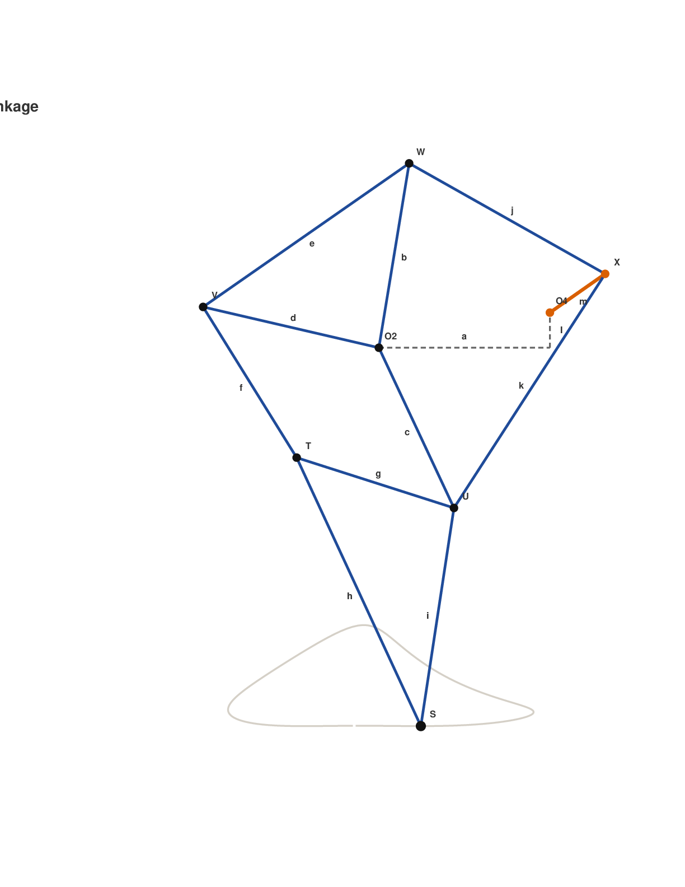

# Strandbeest Simulator

Interactive Theo Jansen leg simulator with a Tkinter GUI, live length sliders, crank animation, and a foot-path trace.

The repository now also includes a static browser version at [docs/index.html](docs/index.html). It is self-contained HTML, CSS, and JavaScript, so it can be hosted directly with GitHub Pages by publishing the `docs/` folder.



## Install `uv`

macOS or Linux:

```bash
curl -LsSf https://astral.sh/uv/install.sh | sh
```


## Run

```bash
uv run python -m strandbeest_gui
```

## Web Version

Open `docs/index.html` locally, or enable GitHub Pages for the repository and choose `Deploy from a branch` with the `docs/` folder as the publishing source.
